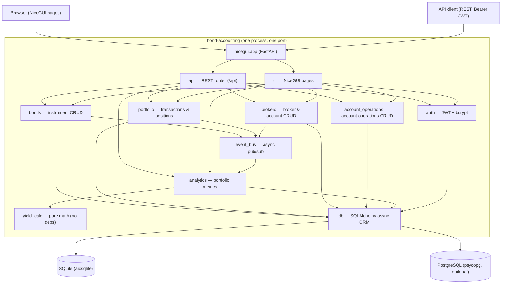
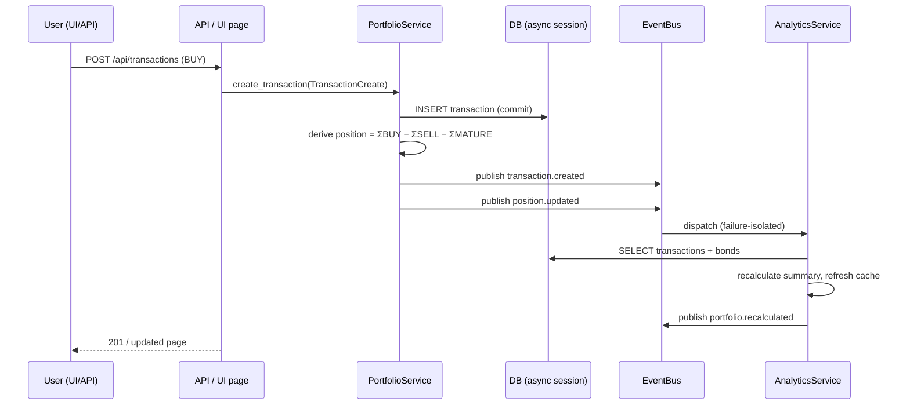

# Architecture

Architecture overview of the **bond-accounting** application — a single-service
(modular monolith) bond portfolio accounting system: bond instruments,
transactions, derived positions, yield analytics, JWT authentication, and a
REST API + NiceGUI web UI served on a single port.

## 1. Overview

The application lets users track a bond portfolio:

- **Instruments** — bonds identified by ISIN, with nominal, coupon rate
  (ANNUAL / SEMI_ANNUAL / QUARTERLY), and maturity date.
- **Transactions** — BUY / SELL / MATURE operations on a bond.
- **Account operations** — DEPOSIT / WITHDRAWAL / TAX operations on a
  broker account.
- **Brokers & broker accounts** — brokers (with commission settings) and
  their accounts (STANDARD / IIS / LTD).
- **Positions** — net bond quantity per user, always **derived** from
  transactions (`sum(BUY) − sum(SELL) − sum(MATURE)`), never stored.
- **Yield analytics** — YTM, current yield, accrued coupon (НКД), coupon
  schedule, portfolio summary, realized P&L.
- **Auth** — username/password (bcrypt) with JWT (HS256); the web UI keeps
  the JWT in a `token` cookie, the REST API expects a Bearer token.

The application is branded as **Home Stocktaking** in the UI (package name
`bond_accounting` retained).

Everything ships in one process: a single uvicorn server exposes both the
NiceGUI pages and the REST API (`/api`), backed by an async SQLAlchemy engine
(SQLite via aiosqlite by default; PostgreSQL supported) with schema managed
by Alembic.

## 2. High-level components



`yield_calc` is a dependency-free module of pure functions: no database, no
event bus, no side effects — only primitive inputs (rates, dates, prices).

## 3. Module responsibilities

All source lives under `src/bond_accounting/`. Public interfaces are the names
re-exported from each package's `__init__.py`.

| Module | Responsibility | Public interface | Depends on |
|---|---|---|---|
| `config` | Settings from YAML + `BOND_*` env vars (pydantic-settings); logging setup incl. third-party logger unification | `load_settings()`, `Settings`, `AppConfig`, `DatabaseConfig`, `AuthConfig`, `EventBusConfig`, `LoggingConfig`; logging is configured via `bond_accounting.config.logging_setup.setup_logging()` and `reset_third_party_loggers()` (public, not re-exported through the package `__all__`) — both reset known third-party loggers (uvicorn, nicegui, sqlalchemy, alembic, fastapi) so their records flow through the single root handler | — |
| `db` | SQLAlchemy 2.0 async ORM: models, engine & session factories | `Base`, `User`, `Bond`, `Transaction`, `AccountOperation`, `create_engine_from_settings()`, `create_session_factory()`. The models also include `Broker` and `BrokerAccount` (defined in `db/models.py`, but not re-exported through the package `__all__`) | `config` |
| `auth` | Register/login service, JWT (HS256) issuing/verification, bcrypt hashing | `AuthService`, `JwtService`, `PasswordHasher`, `TokenPayload`, `AuthError`, `InvalidCredentialsError`, `UsernameTakenError`, `JwtError` | `db` |
| `bonds` | Bond CRUD with EventBus publishing on change | `BondService`, `BondCreate`, `BondDTO`, `BondUpdate`, `BondError`, `BondNotFoundError`, `BondNotOwnedError`, `BondIsinDuplicateError`, `BondDeletionBlockedError` | `db`, `event_bus` |
| `brokers` | Broker & broker-account CRUD with EventBus publishing | `BrokerService`, `BrokerCreate`, `BrokerUpdate`, `BrokerDTO`, `BrokerAccountCreate`, `BrokerAccountUpdate`, `BrokerAccountDTO`, `BrokerHasAccountsError`, `BrokerAccountHasTransactionsError` | `db`, `event_bus` |
| `account_operations` | Account operation CRUD (DEPOSIT/WITHDRAWAL/TAX) | `AccountOperationService`, `AccountOperationCreate`, `AccountOperationUpdate`, `AccountOperationDTO` | `db` |
| `portfolio` | Record BUY/SELL/MATURE transactions, derive positions, publish events | `PortfolioService`, `TransactionCreate`, `TransactionDTO`, `PositionDTO`, `PortfolioError`, `InvalidTransactionError`, `InsufficientPositionError` | `db`, `event_bus` |
| `analytics` | Portfolio/position metrics, coupon schedule, cashflows, realized P&L; reacts to change events | `AnalyticsService`, `attach_to_event_bus()`, `PortfolioSummary`, `PositionAnalytics`, `Cashflow`, `CouponDue`, `RealizedPnl` | `db`, `event_bus`, `yield_calc` |
| `yield_calc` | Pure-math yield calculations | `calculate_ytm()`, `calculate_current_yield()`, `calculate_accrued_coupon()`, `build_coupon_schedule()`, `CouponPayment`, `YtmCalculationError` | — |
| `event_bus` | In-process async pub/sub with topic registry, backpressure, failure isolation | `EventBus`, `AsyncQueueEventBus`, `Message`, `Topic`, `ALL_TOPICS`, `RequestHandlerError`, `RequestTimeoutError` | `config` |
| `api` | REST API router (~30 endpoints under `/api`) + dependency wiring + exception handlers | `api_router`, `build_api_dependencies()`, `register_exception_handlers()`, `ApiDependencies` (frozen dataclass with 7 provider fields), `LoginRequest`, `RegisterRequest` | `auth`, `bonds`, `portfolio`, `analytics`, `brokers`, `account_operations` |
| `ui` | NiceGUI pages (login, register, home, bonds, transactions, analytics, brokers, accounts, operations) with drawer navigation, a dark theme, and modal CRUD forms (`CrudPageMixin`); `create_ui_app()` takes 7 arguments (6 services + `account_operation_service`) | `create_ui_app()` | `auth`, `bonds`, `portfolio`, `analytics`, `brokers`, `account_operations` |
| `main` | Composition root: settings → engine → migrations → services → bus → UI + API → serve & shut down | `main()`, `run()` (console entry point `bond-accounting`) | all |
| `external_bus` | Placeholder for future external bus integration (currently just a package docstring) | — | — |

### Configuration details

- `pydantic-settings` merges `config.yaml` (default path, or `--config`) with
  `BOND_*`-prefixed environment variables; `__` is the nesting delimiter
  (e.g. `BOND_AUTH__JWT_SECRET`, `BOND_APP__PORT`). Env vars win.
- `auth.jwt_secret` has **no default** — it must be provided;
  `warn_if_weak_jwt_secret()` logs a CRITICAL warning for known weak values.
  See `config.yaml` for the supported settings (do not commit real secrets).

## 4. Key design decisions

- **Modular monolith** — one deployable, one port. NiceGUI 3.x serves its own
  `nicegui.app` (a `FastAPI` subclass) and cannot serve an external app, so
  the REST router is mounted directly on `nicegui.app` with
  `ui.run(fastapi_docs=True)` enabling `/docs`, `/redoc`, `/openapi.json`.
- **Positions are always derived** — never stored. Any consumer computes
  `sum(BUY) − sum(SELL) − sum(MATURE)` from the transaction log. This keeps
  the transaction log the single source of truth and avoids drift.
- **Schema managed exclusively by Alembic** — `Base.metadata.create_all` is
  never used in application code. `alembic/env.py` is async and resolves the
  database URL itself through `load_settings()`; `alembic.ini` deliberately
  contains no URL. `alembic upgrade head` runs in-process at startup.
- **Unified third-party logging** — all known third-party loggers (uvicorn server + access,
  nicegui, sqlalchemy, alembic, fastapi) are reset by `setup_logging()` / `reset_third_party_loggers()`
  to propagate into the single root handler in the configured format and level. Uvicorn's own
  `dictConfig` is disabled by passing `log_config=None` through `ui.run(**kwargs)`; the
  `uvicorn_logging_level` comes from `settings.logging.level` with a `NOTSET`→`info` fallback,
  and the NiceGUI welcome `print()` is silenced via `show_welcome_message=False`. PyJWT's
  `InsecureKeyLengthWarning` is captured into the `bond_accounting.pyjwt_warnings` logger (one-time
  `showwarning` wrapper, all other warnings delegate to the previous handler). See ADR-004.
- **Event-driven analytics via in-process async pub/sub** — `bond.updated`,
  `bond.deleted`, `transaction.created`, `transaction.updated`,
  `transaction.deleted`, `position.updated`, `broker.*`,
  `broker_account.*` events trigger an analytics recalculation, which
  republishes `portfolio.recalculated`.
  Subscribers are failure-isolated; ordering is preserved per topic.
- **API router mounted directly on `nicegui.app`** (not a sub-mounted
  `FastAPI()`) so exception handlers and dependency overrides apply to API
  routes; services are injected via `app.dependency_overrides`.
- **SQLite pragmas via a `connect` event listener** — aiosqlite forwards
  `connect_args` verbatim to `sqlite3.connect`, which rejects pragma keys, so
  `PRAGMA key = value` statements run on every new connection instead; values
  are whitelist-validated before interpolation.
- **Event-loop layout** — `main()` owns the main-thread event loop (SIGINT/
  SIGTERM handlers); blocking `ui.run` executes in a worker thread. Alembic
  runs in `asyncio.to_thread` because its `env.py` calls `asyncio.run`.
- **UI auth via cookie set from the browser** — NiceGUI has no server-side
  cookie API from websocket handlers, so `set_token_cookie` writes
  `document.cookie` via `ui.run_javascript`, with `Max-Age` derived from the
  token's `exp` claim and `Secure` added when the page is served over HTTPS.

## 5. Data flow

### Login

1. User submits the login form (UI) or `POST /api/auth/login` (REST).
2. `AuthService.login` verifies the bcrypt hash and `JwtService` issues an
   HS256 JWT.
3. UI: the JWT is stored in the `token` cookie (browser-side); every
   page checks and verifies it on load. REST: the client sends the JWT as a
   Bearer token; `get_current_user_id` verifies it per request.

### Bond create → analytics recalc

1. `BondService.create` writes the bond and commits.
2. It publishes `bond.updated` (with `user_id` in the payload) on the
   `EventBus`.
3. `attach_to_event_bus`-subscribed `AnalyticsService` receives the event and
   recalculates that user's portfolio, refreshing its in-memory cache and
   publishing `portfolio.recalculated`.

### Buy transaction → position update



## 6. Testing architecture

Tests live in `tests/` in a layered pyramid:

| Layer | Directory | Scope |
|---|---|---|
| Unit | `tests/unit/` | Pure logic: yield math, JWT, event bus |
| Integration | `tests/integration/` | Services against a real (SQLite) database |
| API | `tests/api/` | REST endpoints end-to-end via httpx ASGI transport |
| Functional | `tests/functional/` | E2E REST user scenarios (auth, bond CRUD/ownership, portfolio) |
| UI | `tests/ui/` | NiceGUI pages via `nicegui.testing` user simulation |

Shared infrastructure:

- `tests/conftest.py` — fixture stack: env cleanup (`_clean_bond_env`),
  `jwt_service` / `auth_config`, database + Alembic schema, event bus, and
  per-layer service/client fixtures.
- `tests/rest_utils.py` — single source of truth for shared REST test
  constants and httpx helpers; re-exported by
  `tests/functional/_functional_utils.py`.
- `tests/ui/_ui_utils.py` — shared UI-test helpers: element search by kind/content
  (`elements`, `one`), card/table lookups, event triggering (`click`,
  `select_table_row`, `deselect_table_rows`), session cookie injection
  (`authenticate`), and DTO factories (`make_bond`, `make_position`,
  `make_transaction`, `make_summary`) used by all UI tests.
- `tests/ui/conftest.py` — `SimUser` (NiceGUI `User` with a fix for
  fire-and-forget `run_javascript`) and `ui_user`, which registers the real
  pages via `create_ui_app` with mocked services and applies
  `document.cookie` rules to the httpx client.

Test invocation — all layers run with a **single command**:

```bash
uv run pytest -q
```

A single invocation runs every layer (unit, integration, api, functional,
and ui). `tests/ui/conftest.py` handles the `nicegui_reset_globals` session
interaction so the whole suite shares one pytest session safely.

## 7. Out of scope / future

- **`external_bus`** — currently a placeholder package; external event bus
  integration is future work.
- **PostgreSQL** — fully supported by `DatabaseConfig`
  (`postgresql+psycopg` async driver), but SQLite is the primary target.
